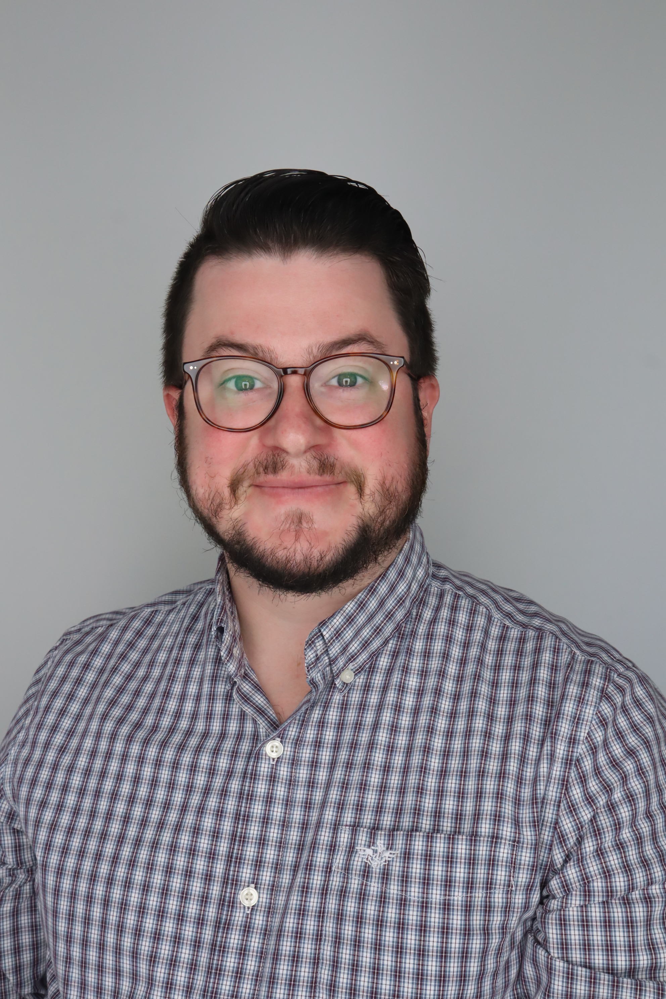
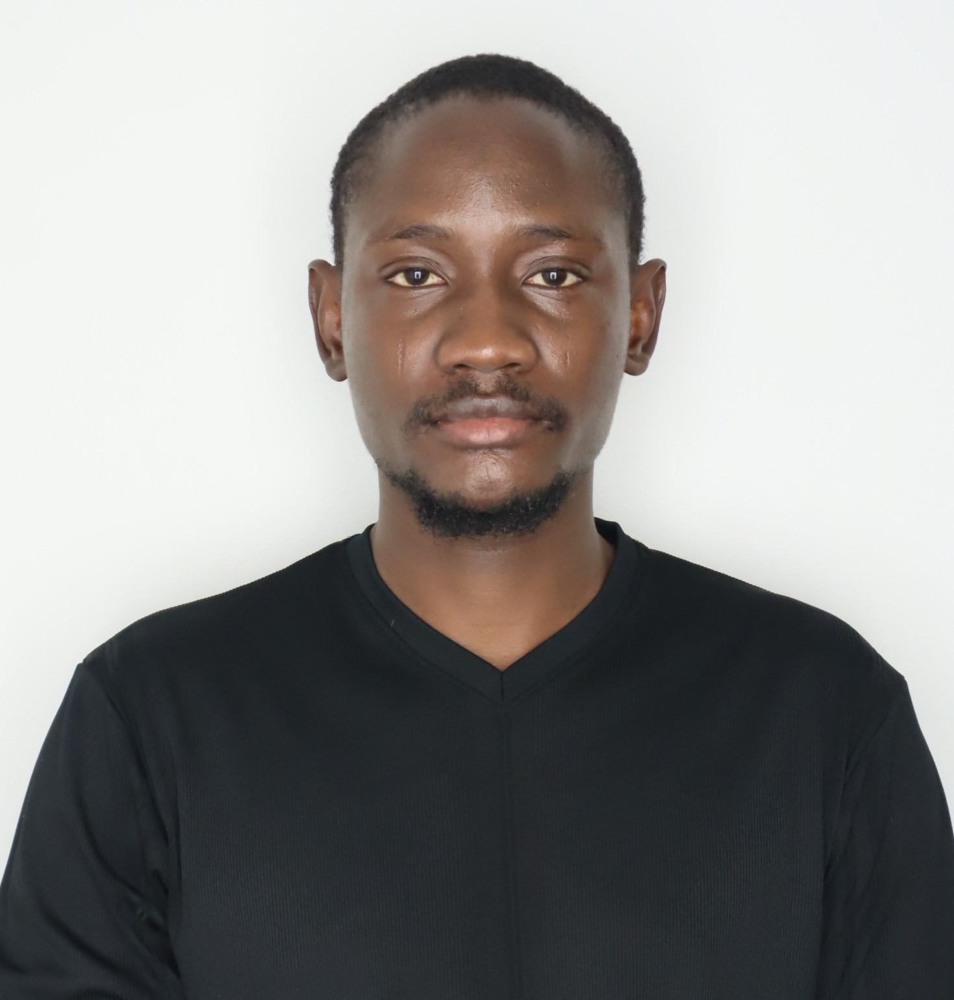

# ⚓ Sports Analytics and Intelligence Lab (SAIL)

### Kennesaw State University
#### PI: Dr. Austin R. Brown

**Turning sports data into smarter decisions.**

The **Sports Analytics and Intelligence Lab (SAIL)** at Kennesaw State University brings together students and faculty to apply **statistics, data science, artificial intelligence, and decision science** to real-world problems in sports.

SAIL is both a **research laboratory and a product-development environment**. We work with sports organizations to develop analytical methods, decision-support tools, and intelligent systems that can improve athlete health, performance, and decision-making.

---

## 🔬 What We Do

SAIL focuses on four interconnected areas:

* **Athlete Health & Performance** — injury and reinjury, workload, recovery, and player development
* **Sports Analytics** — statistical modeling, machine learning, performance analysis, and forecasting
* **Sports Intelligence** — decision support, uncertainty quantification, and human-AI collaboration
* **Applied AI** — generative AI, intelligent systems, and natural-language interfaces for sports data

Our philosophy is simple:

> **The goal isn't to replace human decision-makers with algorithms. It's to give people better information with which to make better decisions.**

---

---

## 🧭 The Crew

### Faculty

<table>
  <tr>
    <td width="160" valign="top">
      
    </td>
    <td valign="top">
      <b>Dr. Austin R. Brown</b> — <i>Principal Investigator</i> 
      "My research spans sports medicine and epidemiology, sports analytics, and educational research. The common thread is process evaluation and improvement. Whether monitoring an athlete’s return from injury or assessing a course redesign, I apply tools from statistical process monitoring to identify when something has meaningfully changed and why it matters."
    </td>
  </tr>
</table>

### Current Students

<table>
  <tr>
    <td width="160" valign="top">
       
    </td>
    <td valign="top">
      <b>Jafaar Olasunkanmi Lawal</b> - <i>Ph.D. Graduate Research Assistant</i> 
       "I am enthusiastic about the intersection of statistics and natural language processing. I hope to contribute to sentiment analysis by combining statistical methods with modern text mining techniques. I am eager to learn and grow as a researcher in this space, and I am also excited to be here."
    </td>
  </tr>
</table>

## 🏟️ Research & Projects

SAIL's work spans methodological research, applied analytics, and real-world product development.

### Athlete Health & Injury

**Predicting Multiple Injuries to Major League Baseball Pitchers**
A logistic regression analysis examining factors associated with multiple injury events among MLB pitchers.

[Research in Sports Medicine (2023)](https://doi.org/10.1080/15438627.2022.2052067)

**A Quality Monitoring Approach to Evaluating Reinjury Likelihood to Major League Baseball Pitchers**
A statistical process monitoring framework combining process capability and CUSUM methods to identify deterioration in pitcher performance following injury.

[Research in Sports Medicine (2026)](https://doi.org/10.1080/15438627.2026.2632610)

**Early Identification of Reinjury Risk Among National Basketball Association Players Using a Quality Monitoring Technique**
A statistical process monitoring framework combining EWMA and CUSUM methods with individualized performance baselines to identify meaningful changes in player performance following injury.

Submitted to: Basketball Studies.

### Emerging Projects

SAIL is expanding this work into:

* Athlete workload and performance monitoring
* Coaching and decision intelligence
* Recruiting and transfer portal analytics
* Sports AI and intelligent systems
* Statistical process monitoring for sports
* AI-assisted analysis of sports data

---

## 🎓 Student Research

SAIL is built around **faculty-mentored student research and development**.

Undergraduate, master's, and doctoral students work on authentic problems using real sports data. Projects may result in:

**Research → Prototypes → Publications → Products**

Students gain experience in statistical modeling, programming, data engineering, AI, visualization, research communication, and collaborative product development.

---

## 🤝 Collaborate With Us

SAIL welcomes collaboration with:

* Collegiate and professional sports organizations
* Coaches and performance staff
* Sports technology companies
* Healthcare and human-performance organizations
* Researchers and academic institutions
* Industry partners

Have a sports problem you'd like to investigate?

**Let's turn it into a research question.**

---

## ⚓ SAIL

**Research. Intelligence. Innovation. Impact.**

*Kennesaw State University*

